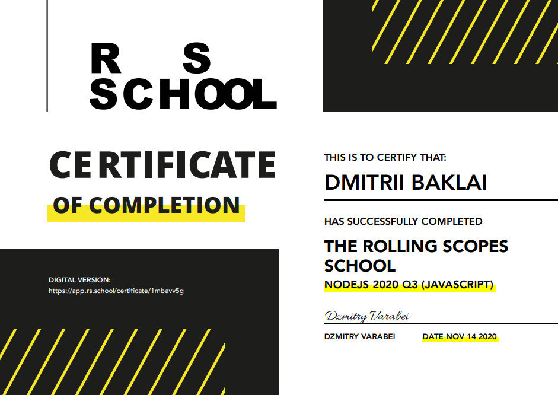

### Программирую на:

- Pascal(Паскаль) (Turbo Pascal, Pascal ABC, PascalABC.NET, Free Pascal);
- Lazarus;
- Delphi;
- С#;
- JavaScript;
- Node.js;
- MathCad;

### Мои сертификаты:

[RS School](https://rs.school/) - это бесплатные курсы, проводимые сообществом разработчиков The Rolling Scopes. Пройдя курс и набрав необходимый рейтинг получил сертификат NODEJS 2020 Q3 (JAVASCRIPT) разработчика.

<!--
**baklai/baklai** is a ✨ _special_ ✨ repository because its `README.md` (this file) appears on your GitHub profile.

Here are some ideas to get you started:

- 🔭 I’m currently working on ...
- 🌱 I’m currently learning ...
- 👯 I’m looking to collaborate on ...
- 🤔 I’m looking for help with ...
- 💬 Ask me about ...
- 📫 How to reach me: ...
- 😄 Pronouns: ...
- ⚡ Fun fact: ...
-->
